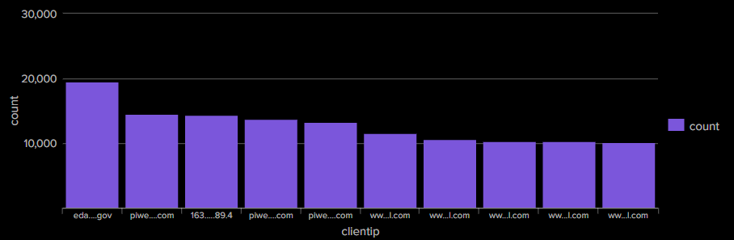
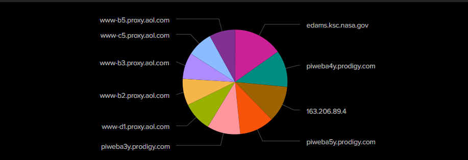
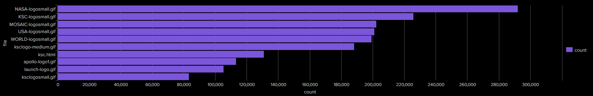
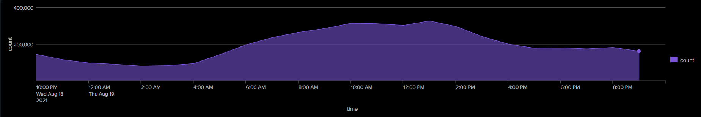
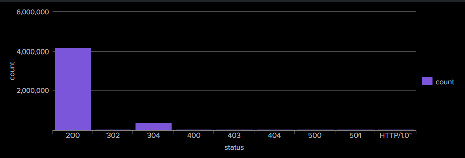
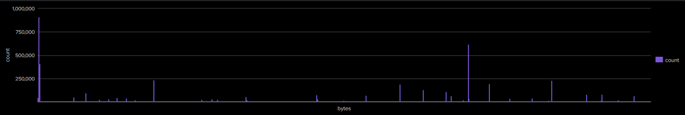
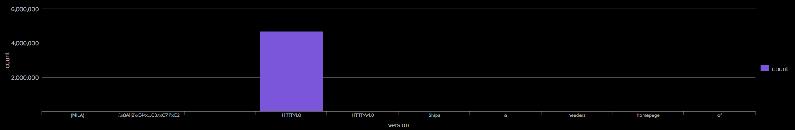
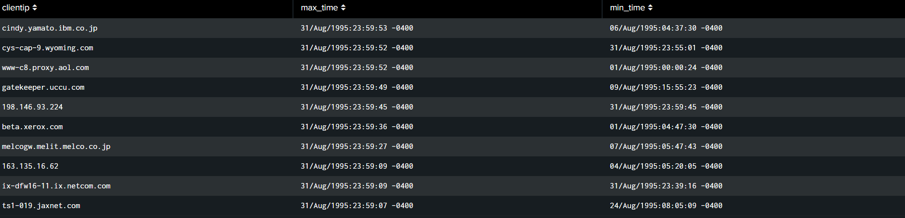

#  HTTP Log Analysis with Splunk SIEM

This project presents a Splunk-based dashboard for analyzing HTTP access logs from [`http_log/`](https://github.com/sanjanamarri2521/HTTP_Log_Analysis/tree/main/http_log) to uncover insights into web traffic, monitor user behavior, and identify anomalies.

Using Splunk SPL (Search Processing Language), the dashboard helps visualize patterns in web requests, server responses, file access, and performance, aiding in security monitoring and performance optimization.

---

## Dashboard Visualizations

Each panel below uses SPL queries to create a meaningful visualization.

---

### 1. Top 10 IP Requests

Displays the top 10 client IPs making the most requests to the server.

---

### 2. Most Accessed Files

Lists the most frequently accessed files from the web server logs.

---

### 3. Requests per Hour

Visualizes the volume of HTTP requests over time, helping identify traffic spikes or unusual access patterns.

---

### 4. HTTP Status Code Distribution

Shows the distribution of HTTP status codes (e.g., 200, 404, 500), useful for monitoring server health and errors.

---
### 5. File Size Distribution

Analyzes the distribution of response sizes returned by the server, helping identify patterns in traffic or anomalies such as unusually large files.

---

### 6. Requests by HTTP Version

Breaks down how many requests use each HTTP version (e.g., HTTP/1.0, HTTP/1.1, HTTP/2.0).

---

### 7. Request Timing Statistics

Highlights top client IPs with the longest and shortest request times, helping detect performance anomalies or outliers.

---

##  Use Cases

- Identify the most active users (IPs) and files  
- Monitor system load and request frequency trends  
- Investigate abnormal status codes or slow requests  
- Optimize server performance based on response size trends

---

## License

This project is licensed under the MIT License. See the [LICENSE](LICENSE) file for details.

---

##  Acknowledgment

This project was inspired by and adapted from:

**[Splunk Projects for Beginners – Project #1: Analyzing HTTP Logs using Splunk SIEM](https://github.com/0xrajneesh/Splunk-Projects-For-Beginners/blob/main/project%233-analyzing-http-logs-using-splunk-siem.md)**  
by [0xrajneesh](https://github.com/0xrajneesh)

Huge thanks to the author for making beginner-friendly Splunk projects available to the community!

---
